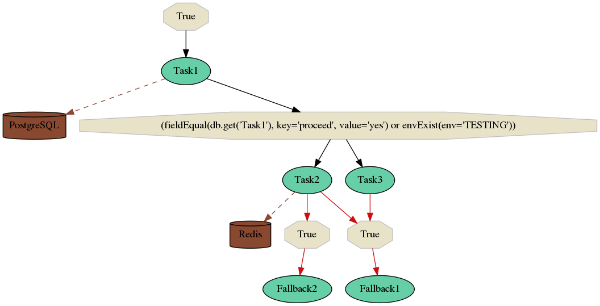

.. _index:

Selinon - A Dynamic Distributed Task Flow Management
----------------------------------------------------

What is Selinon and why should I use it?
########################################

.. sidebar:: Documentation

    .. toctree::
       :maxdepth: 1

       start
       tasks
       storage
       trace
       optimization
       patterns
       practices
       selective
       yaml.conf
       faq
       migration
       development

`Selinon <https://github.com/selinon/selinon>`_ is a tool that gives you a power to define flows, sub-flows of tasks that should be executed in `Celery <http://www.celeryproject.org>`_ - a distributed task queue. If you want to define very simple flows, Celery offers you workflow primitives that can be used. Unfortunately these workflow primitives are very limited when it comes to extending your workflow, working with multiple dependencies or scheduling tasks based on particular conditions.

If you are looking for a workflow solution, take a look at existing solutions, such as `Azkaban <https://azkaban.github.io/>`_, `Apache Airflow <https://github.com/apache/incubator-airflow>`_, `Apache Nifi <https://nifi.apache.org>`_, `Spotify Luigi <https://luigi.readthedocs.io>`_ and others. The main advantage of using Selinon over these is the fact, that you can use it in fully distributed systems and for example let `Kubernetes <https://kubernetes.io>`_ or `OpenShift <https://openshift.io>`_ do the workload (and much more, such as recursive flows, sub-flows support, selective task runs, ...).

Even if you do not plan to run Selinon in a distributed environment, you could still find Selinon useful. Selinon offers you CLI executor that, based on your YAML configuration, executes tasks based on their dependencies and conditions between them.

Take a look at `Selinonlib <https://github.com/selinon/selinonlib>`_ as well. Besides providing utilies for Selinon (such as prepared database and storage adapters) it also gives you a power to simulate, inspect, visualize or do high-level operations on your configuration and system implementation.

Is there available a demo?
##########################

You can take a look at `Selinon demo <https://github.com/selinon/demo>`_ so you can see how Selinon works without deep diving into code and configuration. Just run:

.. code-block:: console

   docker-compose up

What do I need?
###############

In order to use Selinon, you need:

  * a basic knowledge of Python3 (yes, there is no support for Python2!)
  * `YAML markup language <http://yaml.org/>`_ (very intuitive and easy to learn)
  * a basic knowledge of Celery 4 (older versions are not supported) and its `configuration <http://docs.celeryproject.org/en/latest/userguide/configuration.html>`_
  * vegetable appetite 😆

How does it work? - a high level overview
#########################################

The key idea lies in Dispatcher - there is created :obj:`Dispatcher <selinon.dispatcher>` task for each flow. Dispatcher takes care of starting new tasks and sub-flows, checking their results and scheduling new tasks based on your configuration. Dispatcher is transparently scheduled and periodically samples flow status and makes decissions what tasks and flows should be scheduled.

The only thing that needs to be provided by you is a YAML configuration file that specifies dependencies of your tasks and where results of tasks should be stored (if you want persistence). This configuration file is parsed by `Selinonlib <https://github.com/selinon/selinonlib>`_ and automatically transformed to a Python3 code which is then used by Selinon.

See also
********

* `Selinonlib documentation <https://selinonlib.readthedocs.org/>`_
* `Selinonlib project <https://github.com/selinon/selinonlib>`_
* `Celery configuration <http://docs.celeryproject.org/en/latest/configuration.html>`_

Indices and tables
==================

* :ref:`genindex`
* :ref:`modindex`
* :ref:`search`

.. |date| date::
.. |time| date:: %H:%M

Documentation was automatically generated on |date| at |time|.