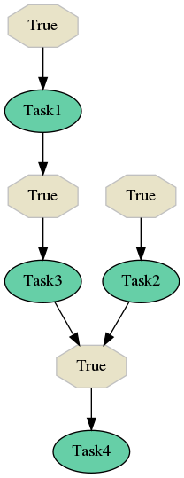

.. _internals:

Deep diving into Selinon internals
==================================

To deeply understand Selinon, let's assume that we have the following flow `flow1`:

If you are interested, here is YAML configuration used to generate this example:

.. code-block:: yaml

  ---
    tasks:
      - name: 'Task1'
        import: 'myproject.tasks'
      - name: 'Task2'
        import: 'myproject.tasks'
      - name: 'Task3'
        import: 'myproject.tasks'
      - name: 'Task4'
        import: 'myproject.tasks'

    flows:
      - 'flow1'

    flow-definitions:
      - name: 'flow1'
        queue: 'flow1_queue'
        edges:
          - from:
            to: 'Task1'
          - from:
            to: 'Task2'
          - from: 'Task1'
            to: 'Task3'
          - from:
              - 'Task2'
              - 'Task3'
            to: 'Task4'

Now let's run this flow with arguments ``{"foo": "bar"}``:

.. code-block:: python

  from selinon import run_flow

  run_flow('flow1', node_args={"foo": "bar"})

What Selinon will do for you as the very first step, it will schedule task :class:`Dispatcher <selinon.dispatcher.Dispatcher>` - there will be sent appropriate message to queue ``flow1_queue`` (see ``queue`` configuration option for flow). Once one of your workers pick the message there will be run :class:`Dispatcher <selinon.dispatcher.Dispatcher>` task.

The aim of dispatcher task, as written earlier, is to handle flow actions. Based on configuration you stated, `flow1` should start with two tasks - `Task1` and `Task2`. As these tasks do not have time nor data dependencies on each other (or their transitive predecessors), they can run in parallel. Before the execution is scheduled, dispatcher checks conditions. In this case both conditions are always true, so dispatcher publishes two messages to default queue (no queue configuration was provided for `Task1` and `Task2`) to execute tasks `Task1` and `Task2`. After that dispatcher is done with work for this run and retries - schedules dispatcher task again, now with different arguments that keep track of scheduled tasks. If you are familiar with Celery, dispatcher issues ``self.retry()`` with different arguments (so you can be sure that the task id for dispatcher does not change).

.. note::

  Conditions are evaluated only once and they are evaluated for every combination of tasks that can fire the edge with the given condition.

Now lets say that a worker picked `Task2` first and it was successfully computed.

Let's assume that dispatcher was scheduled for this flow again. Dispatcher checks status of tasks that were scheduled. Dispatcher finds out that `Task1` haven't finished yet (it can be running on different cluster node or it is still queued) nevertheless dispatcher finds out that task `Task2` was completed. The next edge to be processed is edge leading to `Task4`, but to fire this edge we need to be sure that `Task3` was successful. This is not true as Task3 was not run so dispatcher cannot schedule any other task now. Dispacher retries (schedules itself to the future) with different arguments, that also carry information about the fact that task `Task2` was successful.

.. note::

  Dispatcher is scheduled in the queue based on your ``queue`` flow configuration in your YAML configuration file. This also applies for retries - dispatcher is rescheduled to the same queue.

Meantime another worker picked message to compute `Task1` and this task was successfully computed.

In the next dispatcher run, dispatcher finds out that `Task1` was successful so dispatcher can proceed to scheduling `Task3`. `Task3` is scheduled (a message is sent to the default queue) and that's all what dispatcher can do for this run. It retries marking `Task3` as scheduled and tasks `Task1`, `Task2` as successful (in arguments for the next dispatcher run).

Dispatcher cannot do any other actions unless `Task3` is run, so let's say that `Task3` was successfully computed.

In the next run we can take into account facts that both `Task2` and `Task3` finished so dispatcher can schedule `Task4` and retry. Dispatcher, again, states active tasks (or active sub-flows if we have any) in arguments for the next dispatcher run and retries after some time.

Once task `Task4` would be successfully computed, we can successfully mark the current flow as successful as there are no remaining tasks that could be scheduled. Dispatcher thus ends (does not issue retry) and stores information about finished (or failed) nodes to the result backend (this is done for cases where there are parent flows that need this information or for you to keep track about flows status).

It is very important to note that there is one dispatcher per flow. So if you schedule two flows in parallel, there will be scheduled two dispatcher tasks, each handling one flow.

Sub-flows
#########

As dispatcher is a task as any other, sub-flows are handled by scheduling dispatcher task that handles given sub-flow. So if you have two flows `flow1` and `flow2`, and you run `flow2` as a sub-flow in `flow1` flow, dispatcher in `flow1` will schedule dispatcher task handling `flow2` as a task that is a node in the task dependency graph you provided in the YAML configuration file.

Each dispatcher reports information about finished and failed nodes as a JSON that is stored in the result backend. There are tracked only nodes that are run in the given flow. Any sub-flow related information needs to be computed when requested (such as ``propagate_finished``, see :ref:`YAML configuration <yaml>`).

Failure handling
################

Failure of a task means that the task raised an exception. Currently, there is done quiet straightforward failure handling. If a task fails, dispatcher will keep the failure in dispatcher arguments for the next run. Once there is nothing to proceed with and there are no active nodes, dispatcher will try to recover from flow failure by scheduling fallback tasks or fallback flows (fallback flow nodes). If the fallback was successfully run and it means that dispatcher recovered from flow failure, dispatcher can continue with scheduling new tasks or sub-flows as there would be no failure.

If dispatcher cannot recover from failures in the flow, there is propagated flow failure to parent flows (if any) and the current flow is marked as failed.

.. note::

  Note that dispatcher can keep scheduling new tasks even if some tasks failed. This prevents from time-dependent flow evaluation.

