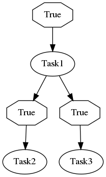
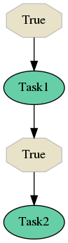

.. _migrations:

Migrations - Redeployment with changes
--------------------------------------

In this section you can find all the details on how to do changes in the configuration files, do redeployment of workers with new configuration files in your cluster without a need of purging queues.

Why are migrations needed
=========================

If you inspect the message payload that is sent to message broker by dispatcher task (see :ref:`internals` section for more info), you can find that there is captured the current flow status (e.g. active edges in the flow graph, finished nodes, active nodes, etc.). Actually this needs to be captured somewhere as dispatcher needs to know which tasks should be and which shouldn't be scheduled during the dispatcher run (at least during flow execution). The way how dispatcher is designed (sampling by retrying) makes ideal place for storing such information the dispatcher message as this message is adjusted each time dispatcher is rescheduled (according to the current flow state). After the flow is finished, this information is no longer needed and thus it's safe to drop it (message is acked and automatically removed from queue).

Imagine you have a flow. You configured workers, did deployment to production, but after some time you realized that some tasks should be removed or added to your flow or you would like to change how the flow is structured. As you already run in production, you don't want to purge queues and drop all the messages that were already published on the message broker. As messages that are available on message broker carry information (state) of the flow, they refer to the configuration that was used when the flow started. If you would like to change flow behaviour, there are 2 main options how to do that.

Using versioned flows
#####################

One of the possibilities here is to introduce versioned flows - you just distinguish flows based on name - e.g. ``flow1_v0`` would be your old flow and ``flow1_v1`` would be the updated flow. By keeping the old configuration in the worker you can easily let the old ``flow1_v0`` to finish (all the messages on the broker get consumed) and after that drop it completely. Meanwhile you will not schedule ``flow1_v0`` after redeployment, but rather the new flow version named ``flow1_v1``.

This approach is applicable if you are fine with letting the published messages to be processed the old way based on ``flow1_v0`` configuration.

.. note::

  If you distinguish flows also on queue names, you can monitor number of messages that are about to be processed using old ``flow_v0`` configuration.

Migration of already published messages
#######################################

Another approach is to change flow behaviour on runtime - that means you have messages queued, but you would like to apply changes in the configuration file after redeployment also on queued messages.

.. danger::

  Do not perform flow changes in the YAML configuration file without generating migrations. It will mostly resolve in fatal and unrecoverable failures in dispatcher task causing it to fail or infinite rescheduling. In general, **changes in the flow structure without performing migrations lead to undefined behaviour**.

For this reason migration of messages comes in handy. Selinon CLI offers you a way how to generate a migration that affects flow execution and lets you decide what to do in case your change affects flow execution based on the current state - tainted flows.

.. note::

  Selinon does not fire added edges to the configuration file that would preceed the current flow state - in other words, dispatcher does not schedule nodes traversing the flow graph backwards. However it works as expected in case of cyclic flows.

Tainted flows
=============

If your change in the configuration file affects flow behaviour, dispatcher marks the affected flow as tainted. A tainted flow is flow that would behave differently if it would be executed with the new configuration, but it has already started and the current state resolves in different flow execution compared to the new configuration file.

Whether a flow is tainted highly depends on state of the flow in which the migration is done and the migration itself.

There are two types of events that lead to tainted flows:

 * tainted edges - flows tainted based on edges that were fired but they do not exist in the new configuration
 * tainting nodes - flows tainted based on nodes that weren't executed as the state of the flow outrun added edges

Tainted edges
#############

Tainted edges are edges that were present in the old configuration but are not present in the new one, or destination nodes of edge were modified. If the state of flow in the deployed system already fired such edge (destination nodes were run as edge condition was evaluated as true), the flow is marked as tainted and requested tainted flow strategy will be triggered based on the migration configuration (see bellow).

Let's say you have a flow as shown on the figure above. In your configuration file you remove the edge that leads from *Task1* to *Task3* so the flow structure will change as visualized on the figure bellow. You generate a migration and do the redeployment, but you have already some flows in progress. Let's say that worker picks dispatcher task, the flow already run *Task1* and fired both edges leading to *Task2* and *Task3*. In this case the flow progress basically waits for these tasks to finish based on the old configuration. However with migration that you did, there is no edge to *Task3* - as this edge was already fired, it tainted the flow. In this case dispatcher will report tainted flow and will behave according to your tainted flow strategy (see `Tainted flow strategy`_ bellow).

In another case, a worker would pick message respecting old configuration in which *Task1* was scheduled, but dispatcher in the previous run did not find that *Task1* finished (edges to *Task2* and *Task3* were not fired). In this case the flow is not marked as tainted and dispatcher continues checking state of nodes respecting the new configuration with migration.

Tainting nodes
##############

Tainting nodes are nodes that were run based on the current state of flow, but there was added an edge in migration that would be evaluated (as source/tainting nodes already run) if all of the tainting nodes would get finished.

Let's illustrate this scenario as well. In this case you have a flow that runs two tasks - *Task1* and *Task2* after the *Task1* finishes. You deployed this version of configuration, but after a while you decided to add a new task called *Task3* that is scheduled after *Task1* successfully finishes. This scenario is visualized on the figure bellow. You create a migration file do the redeployment with new configuration file and generated migration. Some flows were already in progress - let's say that worker picked dispatcher task and the state of the flow indicates that *Task1* was already run, the edge to *Task2* was already triggered (dispatcher waits for *Task2* to finish), but with new configuration and migration, there would be evaluated the edge to *Task3* as well (this was not done with the old configuration). Dispatcher does not schedule *Task3* as this edge would be fired after *Task1* finishes (the event noticing that *Task1* finished was already tracked), but rather marks flow as tainted. Once the flow is marked as tainted, the tainted flow strategy (see `Tainted flow strategy`_ bellow) is evaluated.

.. note::

   Conditions are not evaluated in case of tainting nodes. Tainted flow indicates that the edge *would be evaluated and possibly fired* based on result of condition result.

Tainted flow strategy
=====================

When a flow is marked as failed, you can configure how dispatcher should behave in such situations. There are three types of tainted flow strategies:

  1. ``IGNORE`` (*default*) - migrations marked as ``IGNORE`` do not perform any actions on tainted flows, a tainted flow is reported using the tracing mechanism, but the execution continues
  2. ``RETRY`` - this strategy causes that the whole flow is retried - all results computed until migration will not be reused in the retried flow
  3. ``FAIL`` - flow will be immediately marked as failed - previously scheduled tasks will be run (as they are already scheduled) ignoring state

See :ref:`trace` section for information about captured details. If there is performed migration chaining (see bellow), state is distinguished based on tainted flow strategy with the highest impact:

 * if at least one flow migration has strategy ``FAIL`` - the tainted flow will fail
 * if at least one flow migration has strategy ``RETRY`` but no ``FAIL``, the tainted flow will be marked as ``RETRY``
 * if all flow migrations have strategy ``IGNORE`` and there is not present ``RETRY`` nor ``FAIL`` strategy, tainted flows will be ignored but reported in the tracing mechanism

Migration chaining
==================

Migrations can be chained - they are incrementally numbered starting with 1. A special migration version 0 means that no migrations are present - Selinon was not set up to use migrations and no migrations are present. If you would like to do migrations, add anytime (even when you deployed worker with no migrations present) ``migration_dir`` to the global configuration section in the ``nodes.yaml`` file (see :ref:`YAML configuration <yaml>` section for more details). These migrations will be run afterwards once worker detects migrations to be present.

.. code-block:: yaml

  global:
    # The migration dir can be an absolute or relative path to the process working directory.
    # Preferably state absolute path.
    migration_dir: 'path/to/dir/containing/migrations'

Note that migration version is not per flow specific, but rather deployment specific. This means that you can see even in messages incrementally changing migration version for flows that do not have any affecting migrations.

If you would like to perform more changes that should trigger different migration strategies, it's perfectly okay to generate multiple migrations and apply them with different tainted flow strategy based on the flow state in your deployment. Migrations get applied based on migration versions (incrementally) as you would expect respecting tainted flow strategy.

.. danger::

  Make sure you **do not generate the same migration multiple times**. That would resolve in undefined behaviour.

Generating migrations
=====================

Migrations can be generated using the Selinon CLI. It operates either on explicitly supplied old and new configuration files on which the migration is computed or you can use the built in support for Git VCS. Selinon in that case checks Git history for older versions of configuration files supplied.

.. code-block:: console

  $ # Add --verbose parameters for noisy output, use git to retrieve old configuration files. Path to migration_dir will be taken from nodes.yaml.
  $ selinon-cli -vvv migrate --flow-definitions myapp/flows/*.yaml --nodes-definition myapp/nodes.yaml --git

You can also explicitly adjust migration directory. Implicitly Selinon will take into account ``migration_dir`` stated in the global section of ``nodes.yaml`` file. Also make sure you are pointing to the right directory as migrations files are numbered incrementally so Selinon needs to know the previous migration version that is distinguished based on presence of migration files in the ``migration_dir`` directory.

.. code-block:: console

  $ # Explicitly point to old configuration files and the migration directory, set tainted flow strategy as FAILED.
  $ selinon-cli -vvv migrate --flow-definitions myapp/flows/*.yaml --nodes-definition myapp/nodes.yaml --old-flow-definitions myapp/old_1/flows/*.yaml --nodes-definition myapp/old_1/nodes.yaml --migration-dir myapp/migration_dir/ --tainted-flow-strategy FAIL

Generated migrations are JSON files with computed tainting nodes, tainted edges and edge translation (renumbering and edge dropping if needed). These JSON files also carry some metadata such as where, when and by who the given migration was created. You can suppress capturing metadata by generating migrations with the ``--no-meta`` option.

.. note::

  Conditions do not change graph structure - changes in conditions do not imply in creating new migration files. Conditions affect only graph execution path.

Migrations and fallbacks
========================

Migrations do not apply to fallback nodes and their dependencies. Fallback edges represent exceptional path that is triggered if there was a failure. You can safely do redeployment without a need of generating migrations for changes in fallbacks. The behaviour of fallback evaluation will respect fallback configuration based on the current configuration available in deployment.

.. note::

  Fallback edges are evaluated at the end of flow in case of failures. The aim of fallback edges is to recover from flow failures and thus represent exceptional paths - they can however lead to continuing flow execution in the main path (not the exceptional) based on finished tasks in fallbacks.

Using and tracing migrations
============================

Once you create migrations, make sure your migrations are present in the deployed worker so Selinon can transparently apply generated migrations. Without migration files present, Selinon is unable to perform migrations - that could lead to undefined behaviour when old messages would be processed with newer and modified configuration.

Take a look at the :ref:`trace` section that will point you to :obj:`tracing events <selinon.trace>` that are emitted on migrations. They also carry some information that could help you with debugging and understanding what's going on in your system.

Migration skew
==============

There is a special error that is reported in case of inconsistency in migration files and the migration version carried within the message for dispatcher task - :class:`MigrationSkew <selinon.errors.MigrationSkew>`. Dispatcher issues retry (without affecting the flow ``retry`` configuration option) that leads to republishing the message. This error indicates that the worker was unable to process the given message as migration version in the received message is newer than available migrations on the worker. In other words, worker is unable to correctly process the message.

This error can indicate that you have workers available with different migration versions available. If you do rolling updates where your replica count of old workers decrements while new workers are spawned, the ``MigrationSkew`` error can be seen. New workers start to publish messages that are not suitable for old workers, but some of the old workers that are still alive tried to process newly published messages. As you would expect, by republishing messages, old workers give up with processing new message types and leave the processing for a new worker with the new migration present.

Flow configuration for examples
===============================

The tainted flow figures were created using the following configuration.

.. code-block:: yaml

    tasks:
      - name: 'Task1'
        import: 'myapp.tasks'
      - name: 'Task2'
        import: 'myapp.tasks'
      - name: 'Task3'
        import: 'myapp.tasks'

    flows:
      - 'flow1_tainted'
      - 'flow2_tainted'

    flow-definitions:
      - name: 'flow1'
        edges:
          - from:
            to: 'Task1'
          - from: 'Task1'
            to: 'Task2'
          - from: 'Task1'
            to: 'Task3'

      - name: 'flow2'
        edges:
          - from:
            to: 'Task1'
          - from: 'Task1'
            to: 'Task2
