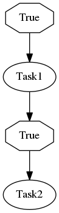

.. _optimization:

Optimization
------------

Selinon offers you a highly scalable solution. By design, you can find two optimization techniques interesting. Both are discussed in the following sections.

Flow Optimization & Dispatcher scheduling
=========================================

In order to optimize your flow execution, you need to deeply understand core concept behind Selinon. As you already read, the key idea behind Selinon is dispatcher (see :class:`Dispacher <selinon.dispatcher.Dispatcher>`). Dispatcher is periodically scheduled and checks state of tasks in the flow and schedules new if neccessary.

To understand it even more, let's assume that we have the following flow `flow1` and we request Selinon to run it:

If you are interested, here is YAML configuration used to generate this example:

.. code-block:: yaml

  ---
    tasks:
      - name: 'Task1'
        import: 'myproject.tasks'
      - name: 'Task2'
        import: 'myproject.tasks'
      - name: 'Task3'
        import: 'myproject.tasks'
      - name: 'Task4'
        import: 'myproject.tasks'

    flows:
      - 'flow1'

    flow-definitions:
      - name: 'flow1'
        queue: 'flow1_queue'
        edges:
          - from:
            to: 'Task1'
          - from:
            to: 'Task2'
          - from: 'Task1'
            to: 'Task3'
          - from:
              - 'Task2'
              - 'Task3'
            to: 'Task4'

**TODO**

Storage Optimization & Distributed Caches
=========================================

By using Selinon you can reach to two main issues with your cluster on heavy load:

  1. Your cluster is not powerful enough to serve requested number of tasks.
  2. Your storage/database cannot process requested numbers of requests.

In the first case the solution is simple: buy/use more hardware.

In the later one there are two main approaches how to tackle such bottleneck. You can always use more storage replicas or split data accross multiple storages and transparently configure Selinon to use different storages for different purposes (see storages aliasing in :ref:`practices`).

If the above solution is not suitable for you or you want to optimize even more, Selinon offers you an optimization that introduces distributed caches. These caches are distributed across nodes (workers) in your cluster and act like a caching mechanism to reduce number of requests to storages/databases and keep data more close to execution nodes.

Selinon by default uses cache of size 0 (no items are added to the cache). There are prepared in-memory caches like FIFO (First-In-First-Out cache), LIFO (Last-In-First-Out cache), LRU (Least-Recently-Used cache), MRU (Most-Recently-Used cache), RR (Random-Replacement cache). See `Selinonlib documentation <https://selinonlib.readthedocs.org>`_ for more info.

.. note::

  You can simply use for example Redis for caching. Just deploy Redis in the same pod as your worker and point caching mechanism to Redis adapter in your YAML configuration adapter. This way you will reduce number of requests to database as results get cached in Redis (available in the same pod) once available.

Caching task results
####################

Results of your tasks can get cached. This is especially useful when you use predicates that query storage/database often. To define a cache just provide configuration in your YAML configuration as shown bellow:

.. code-block:: yaml

  tasks:
    - name: 'Task1'
      import: 'myapp.tasks'
      cache:
        # from myapp.cache import RedisCache
        name: 'RedisCache'
        import: 'myapp.cache'
        configuration:
          host: 'redis'
          port: 6379
          db: 0
          password: 'secretpassword'
          charset: 'utf-8'
          host: 'mongo'
          port: 27017

Results are added to cache only if dispatcher requests results from cache for predicates.

.. note::

  Caching task results could be beneficial if you have a lot of conditions that depend on some task results. They could be even more beneficial if you do flow or task throttling with conditions (see :ref:`practices` for more info).

Caching task states
###################

You can also introduce caching mechanism for task states. Note that task states are handled by Celery (refer to Celery's ``AsyncResult`` for more details). Selinon offers you a way on how to place a cache as an intermediate:

.. code-block:: yaml

  flow-definitions:
    - name: 'flow1'
      cache:
        # from myapp.cache import RedisCache
        name: 'RedisCache'
        import: 'myapp.cache'
        configuration:
          host: 'redis-cache'
          port: 6379
          db: 0
          password: 'secretpassword'
          charset: 'utf-8'
          host: 'mongohost'
          port: 27017
      edges:
        - from:
          to: 'Task1'

As you can see, caches are per-flow specific and configurable. This way you can easily use caches only for flows that you consider critical for caching mechanism.

The ``RedisCache`` implementation has to derive from :class:`Cache <selinon.cache.Cache>` as well and implement required methods. Note that the configuration is passed to cache constructor similarly as in :class:`DataStorage <selinon.dataStorage.DataStorage>` case - as keyword arguments (see :ref:`storage`).

.. note::

  Caching task states is generally a good idea if you depend on many task states in your flow edges (a lot of source tasks in edges) and these tasks have various execution time (very "width" flows).
