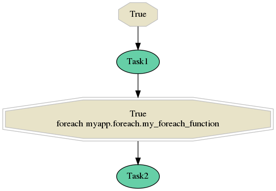
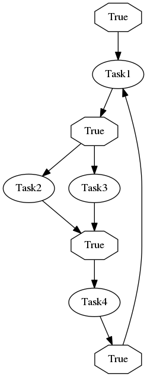
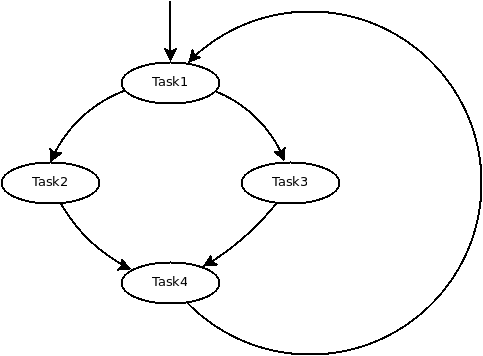
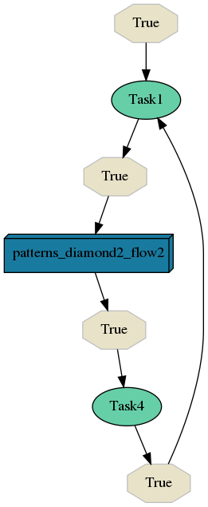
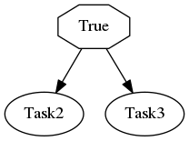

.. _patterns:

Useful flow patterns
--------------------

This section might give an overview of some flow patterns, how to model them and how they behave in different situations.

Variable number of child tasks or sub-flows
###########################################

If you would like to schedule multiple tasks (or sub-flows) of a same type, this configuration will perfectly work for you (assuming you want to schedule 3 tasks `Task2`):

.. code-block:: yaml

  flow-definitions:
    - name: 'flow1'
      edges:
        - from:
          to: 'Task1'
        - from: 'Task1'
          to:
            - 'Task2'
            - 'Task2'
            - 'Task2'

OK, now let's assume that you don't know how many tasks should be executed and you want to determine (or compute) the exact task count on runtime. Selinon offers you to do that by plugging your *foreach function*:

.. code-block:: yaml

  flow-definitions:
    - name: 'flow1'
      edges:
        - from:
          to: 'Task1'
        - from: 'Task1'
          to: 'Task2'
          foreach:
            # from myapp.foreach import my_foreach_function
            function: 'my_foreach_function'
            import: 'myapp.foreach'

Here is the corresponding visualization:

An example of such foreach function could be:

.. code-block:: python

  def my_foreach_function(storage_pool, node_args):
      return range(node_args.get('task2_schedule_count', 0))

.. danger::

  As foreach function is executed by dispatcher it **can not** raise any exceptions. Raising an exception in foreach function leads to undefined behaviour.

.. note::

  You can have multiple destination nodes in edge definition even with foreach function in use.

The return value for foreach function should be an iterable (see bellow why) which length determines number tasks that should be scheduled.

Arguments for the foreach function are:

* **storage_pool** - instantiated :class:`StoragePool <selinon.storagePool.StoragePool>` that can be used to query parent task results
* **node_args** - arguments of the current flow

.. note::

  You can combine the ``foreach`` configuration with ``condition``. Provided condition would get evaluated before foreach function as one would expect.

If you would like to schedule sub-flows dynamically, you can do so by providing a sub-flow in the destination of edge definition:

.. code-block:: yaml

  flow-definitions:
    - name: 'flow1'
      edges:
        - from:
          to: 'Task1'
        - from: 'Task1'
          to: 'flow2'
          foreach:
            # from myapp.foreach import my_foreach_function
            function: 'my_foreach_function'
            import: 'myapp.foreach'
            # uncomment if results of the foreach function should be used as sub-flow arguments
            #propagate_result: true

In case you also provide ``propagate_result`` as true, each entry in the resulting iterable would be propagated to sub-flow `flow2` as sub-flow arguments.

Permutations of all parent tasks a.k.a Cyclic diamond with combinations
#######################################################################

Consider the following flow definition:

.. code-block:: yaml

  flow-definitions:
    - name: 'flow1'
      edges:
        - from:
          to: 'Task1'
        - from: 'Task1'
          to:
            - 'Task2'
            - 'Task3'
        - from:
            - 'Task2'
            - 'Task3'
          to: 'Task4'
        - from: 'Task4'
          to: 'Task1'

A visualization of such flow using Selinonlib CLI would be:

If the visualization is not straightforward for you at first, basically there is a "diamond" that is called in cycle (without conditions):

As one would expect `Task4` is called after `Task2` and `Task3` are finished. Now let's simulate how Selinon would evaluate such cyclic dependencies.

We start with task `Task1`. After task `Task1` finishes, Selinon schedules `Task2` and `Task3`. Let's assign identifiers (id) to these tasks:

* `Task2` with id `<task2_1>`
* `Task3` with id `<task3_1>`

So now Selinon can proceed to task `Task4`. This task will have parent tasks with identifiers `<task2_1>` and `<task3_1>` (for `Task2` and `Task3` respectively).

Once task `Task4` finishes, Selinon will schedule `Task1` again. After the second `Task1` finishes, there are started `Task2` and `Task3`, now with the following identifiers:

* `Task2` with id `<task2_2>`
* `Task3` with id `<task3_2>`

And we can proceed to task `Task4`. Now the question could be: What will be parent tasks of task `Task4` in the second iteration?

The answer is that there will be scheduled multiple tasks `Task4` with the following parent task identifiers:

1. Task4 with parent identifiers:
  * `<task2_1>` for task `Task2` from the first iteration
  * `<task3_2>` for task `Task3` from the second iteration

2. Task4 with parent identifiers:
  * `<task2_2>` for task `Task2` from the second iteration
  * `<task3_1>` for task `Task3` from the first iteration

3. Task4 with parent identifiers:
  * `<task2_2>` for task `Task2` from the second iteration
  * `<task3_2>` for task `Task3` from the second iteration

If we would stop flow after the second iteration (before task `Task1` is run for the third time), we would see that there were executed four tasks `Task4` to **respect all possible combinations**.

Cyclic Diamond without combinations
###################################

If you would like to avoid running `Task4` in the previous example for each combination and rather run it once per iteration, you need to create a sub-flow:

.. code-block:: yaml

  flow-definitions:
    - name: 'flow1'
      edges:
        - from:
          to: 'Task1'
        - from: 'Task1'
          to: 'flow2'
        - from: 'flow2'
          to: 'Task4'
        - from: 'Task4'
          to: 'Task1'

     - name: 'flow2'
       edges:
        - from:
          to: 'Task2'
        - from:
          to: 'Task3'

The the visualization of flow `flow1` would be:

And the visualization of flow `flow2` would be:

Now flow `flow2` would be executed once per each iteration in flow `flow1` and there will be exactly one `Task4` invocation per each flow `flow1` iteration.

.. note::

  You can pass ``propagate_finished`` (or ``propagate_compound_finished``) and ``propagate_parent`` to pass information about parent nodes and finished nodes. See :ref:`YAML configuration <yaml>` for more info.

Aggregating tasks from sub-flows
################################

Results of flows are serialized and stored as JSONs in the result backend (configured by Celery configuration). Each dispatcher reports only tasks and flows that were started *inside* flow that was handled by dispatcher task (except ``nowait`` nodes). Tasks from sub-flows are captured in dispatchers that handle started sub-flows.

If you request to propagate finished nodes from sub-flows to tasks as parents you need to explicitly state ``propagate_finished`` as true in your YAML configuration option. Information is gathered and you can transparently query parent task results (or failures).

By default you need respect how sub-flows are organized - so if your flow `flow1` starts sub-flow `flow2` and that starts `flow3`, you need to respect this organization if you would like ask for results of task `Task1` started in flow `flow3` from flow `flow1`:

.. code-block:: python

  from selinon import SelinonTask

  # this task is run in flow1
  class MyTask(SelinonTask):
      def run(self, node_args):
          print('Task1' in self.parent['flow2']['flow3'].keys())  # should be True iff Task1 was successful in flow3
          task1_result = self.parent_flow_result(['flow2', 'flow3'], 'Task1')  # optionally pass index if there were multiple instances of Task1
          print('Result of Task1 run in parent sub-flow flow3 is {}'.format(task1_result))

If you would like to compound (or flatten) these parent sub-flow organization details, just set ``propagate_compound_finished`` instead of ``propagate_finished``. In that case you can directly use:

.. code-block:: python

  from selinon import SelinonTask

  # this task is run in flow1
  class MyTask(SelinonTask):
      def run(self, node_args):
          print('Task1' in self.parent['flow2']['flow3'].keys())  # should be True iff Task1 was successful in flow3
          task1_result = self.parent_flow_result('flow2', 'Task1')  # optionally pass index if there were multiple instances of Task1
          print('Result of Task1 run in parent sub-flow flow3 (ignoring flow2 organization) is {}'.format(task1_result))

.. note::

  By setting ``propagate_compound_finished`` you will lose information in which sub-flow were which tasks run. If you run tasks of a same name in different sub-flows, these tasks will be merged into one single list.
