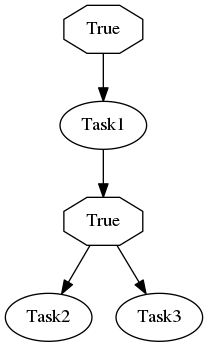

.. _selective:

Selective task run
------------------

Selinon offers you a way how to create a declarative configuration written in YAML files that enable you to define flows. You can run these flows as one unit - all tasks in the flow get executed based on conditions and their time and data dependencies (edges that you stated).

Now suppose that you run same flow multiple times for the same flow arguments. In some cases you would like to run only some subset of tasks without stating all possible subsets of flows that can possibly occur. Selinon offers you a way how to cherry-pick tasks that should be run in your flow. Selinon will then compute all edges that need to be fired in order to get to your desired task with respect to task dependencies.

Now let's assume that you defined the following flow:

Now let's assume that you want to run only `Task2`. The only thing you need to do is to run flow `selective_flow1` with the following code snippet:

.. code-block:: python

   from selinon import run_flow_selective

   run_flow_selective('selective_flow1', ['Task2'], node_args={'foo': 'bar'})

Refer to :func:`run_flow_selective() <selinon.utils.run_flow_selective>` for more information about this function.

Selinon will now by default run only `Task1` and `Task2` as that is the computed path to `Task2` (avoiding `Task3` run). Running task `Task1` is also optional - results could be reused from previous runs as well - see selective run function that is discussed in the following sections.

.. note::

  You can find selective task runs useful for various scenarios:

  * for tasks that results vary in time so you want to recompute them (maybe periodically) and reuse results of tasks that you have already computed
  * bug fixes in some task does not require you to run the whole flow again - you can use ``run_subsequent`` to run also affected tasks that are direct on indirect dependencies of requested task
  * and anything specific for your application

Reuse results in selective flows
================================

If you would like to avoid running some task in selective runs (let's say `Task1` from the previous example) and reuse results from previous runs, you can simply register a `selective run function` in your YAML configuration file in task definition:

.. code-block:: yaml

 tasks:
   - name: 'Task1'
     import: 'myproject.tasks'
     selective_run_function:
       # from myproject.selective import selective_run_function
       name: 'selective_run_function'
       import: 'myproject.selective'

This function gets called by dispatcher in order to decide whether the desired task should be run based on result that this function computes.

.. note::

  Refer to :func:`selinon.routines.always_run` for default selective run function definition.

The selective run function signature is:

.. code-block:: python

  selective_run_function(flow_name, node_name, node_args, task_names, storage_pool)

Arguments passed to this function:

* **flow_name** - name of flow in which this task was requested to run
* **node_name** - name of the node in the flow for which the ``selective_run_function`` was called
* **node_args** - arguments supplied to the flow
* **task_names** - tasks that were requested to start in the selective flow run (same as passed to ``run_flow_selective``)
* **storage_pool** - instantiated :class:`StoragePool <selinon.storage_pool.StoragePool>` with appropriate mapping (so you can use this storage pool for querying parent tasks results)

The result of ``selective_run_function`` should be ``None`` if the node should be run (to be more precise scheduled) or id of task which result should be reused.

.. danger::

  The selective run function gets executed by dispatcher. This means that it **cannot** raise any exceptions. If an exception is raised, the behaviour in such cases is undefined.

  And, of course, the id that is returned from this function **has to** exist.

The selective run function is called only for tasks on the path, they are never run for tasks that are not on the direct path to desired task. It is also not called on tasks that you requested to run in selective flow as they are always run.

.. note::

  To fire a selective task run, the following conditions need to be met:

  * desired task has to be in the flow (or in any of the sub-flows if ``follow_subflows`` was set)
  * there has to be a direct path to desired task, not via failure edges
  * if there are multiple paths to desired task/tasks all of them are run
  * if there is a direct or indirect cyclic edge to a task, this cyclic edge is always included (you can pass explicit flow arguments to avoid this behaviour)
  * naturally, it is possible that the selective flow run does not reach desired tasks (tasks that were requested to start) due to condition evaluation on the path

Sub-flows and subsequent tasks in selective task runs
=====================================================

Selinon by default computes only paths for one flow - the flow that you stated in the selective run. If you wish to run desired task also in sub-flows, configure ``run_subsequent`` as true. In this case Selinon will check all sub-flows for desired task occurrence and run also sub-flows, if necessary. Note that desired task in this case needs to be present in any of sub-flows (not necessary in the top-level one).

If you wish to run all subsequent tasks that depend on tasks that you stated in your selective task run, pass ``run_subsequent`` as true in your selective configuration. In this case the selective run function will not get called, rather all subsequent tasks get scheduled based on condition as in basic flow run.

Using selective task runs from YAML configuration
=================================================

Now let's consider that you defined a flow in our YAML configuration file and you want to reuse this definition in order to run this flow from another flow. Moreover, we want to run only some certain tasks. Selinon easily offers you a solution to this:

.. code-block:: yaml

  ---
    flow-definitions:
      - name: 'selective_flow2'
        edges:
          - from:
            to: 'Task4'
          - from: 'Task4'
            to: 'selective_flow1'
            selective:
              tasks:
                - 'Task2'
              follow_subflows: false
              run_subsequent: false

The configuration stated above will define selective sub-flow, that basically runs only `Task2` from our previous flow `selective_flow1`. Semantics of keys in the YAML configuration conform to arguments that are passed to the selective run function.

For better understanding, here is your ``selective_flow2`` visualization:

.. image:: _static/selective_flow2.png
  :align: center

Note that in this particular scenario you can also do:

.. code-block:: python

   from selinon import run_flow_selective

   # requesting to run Task2 (stated in selective_flow1), but selective_flow1 is a sub-flow of selective_flow2
   # note follow_subflows!
   run_flow_selective('selective_flow2', ['Task2'], node_args={'foo': 'bar'}, follow_subflows=True)

Without the ``selective`` part in your `selective_flow2` configuration. Using ``selective`` in your YAML configuration is highly dependent on your use-case (and the selective run function implementation).

YAML configuration used in examples
===================================

.. code-block:: yaml

  ---

    tasks:
      - name: 'Task1'
        import: 'myproject.tasks'
      - name: 'Task2'
        import: 'myproject.tasks'
      - name: 'Task3'
        import: 'myproject.tasks'
      - name: 'Task4'
        import: 'myproject.tasks'

    flows:
      - 'selective_flow1'
      - 'selective_flow2'

    flow-definitions:
      - name: 'selective_flow1'
        edges:
          - from:
            to: 'Task1'
          - from: 'Task1'
            to:
              - 'Task2'
              - 'Task3'
      - name: 'selective_flow2'
        edges:
          - from:
            to: 'Task4'
          - from: 'Task4'
            to: 'selective_flow1'
            selective:
              tasks:
                - 'Task2'
              follow_subflows: false
              run_subsequent: false
