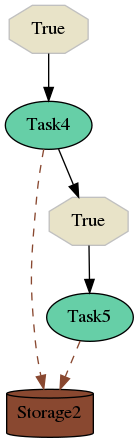
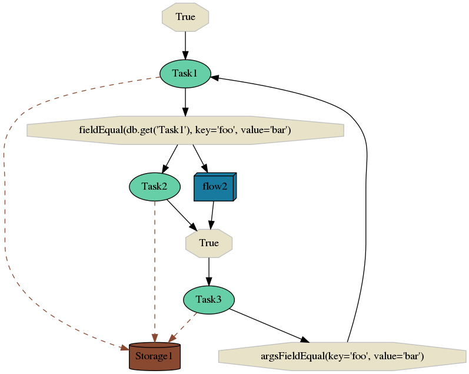

.. _start:

A Quick Start Guide
-------------------

This section aims to provide you a very high overview of the Selinon project and its configuration. If you want to get deeper, follow next sections.


Selinon Concept Overview
========================

A system consist of flows, :ref:`storages or databases <storage>` and :ref:`tasks <tasks>`. Each flow defines a directed graph (that can be even cyclic, so no DAG limitations) of well defined dependencies on nodes that compute results. A node can be either a task or another flow, so you can make flows as nested as desired. You can make decisions on when to run which nodes based on conditions that are made of predicates.

YAML Configuration Overview
===========================

Selinon is configured by easy to learn, easy to read and easy to maintain declarative configuration files written in `YAML markup language <http://yaml.org/>`_.

In order to use Selinon, you have to :ref:`implement tasks <tasks>` and define your flows in a YAML configuration file (or split it across multiple YAML configuration files).

Setting up Selinon
##################

In order to configure Selinon you need to do create a Celery's ``app`` instance, pass all Celery-related configuration to it. After that you are ready to configure Selinon:

.. code-block:: python

  from selinon import Config
  from celery import Celery
  from myapp.celery_settings import CelerySettings

  app = Celery('tasks')
  app.config_from_object(CelerySettings)

  Config.set_celery_app(app)
  Config.set_config_yaml('path/to/nodes.yaml', ['path/to/flow1.yaml', 'path/to/flow2.yaml'])

Please refer to `Celery configuration <http://docs.celeryproject.org/en/latest/userguide/configuration.html>`_ for Celery-related pieces.

Naming Convention
#################


Imagine you defined two flows (`flow1` and `flow2`) that consist of five tasks named `Task1`, `Task2`, `Task3`, `Task4` and `Task5`. Such flows are illustrated on images bellow.



In the flow `flow2` (shown above) we start node `Task4` on condition that is always true (we start if Selinon was requested to start `flow2`). After `Task4` finishes, we start (always) node `Task5` which ends the flow `flow2`. Results of tasks are stored in the database named `Storage2`.



The second flow is slightly more complex. We (always) start with `Task1`. `Task1` will transparently store results in `Storage1`. After `Task1` finishes, Selinon (to be more precise dispatcher task) checks results of `Task1` in `Storage1` and if condition ```result['foo'] == 'bar'``` is evaluated as True, dispatcher starts nodes `Task2` and `flow2`. After both `Task2` and `flow2` finish, dispatcher starts `Task3`. If the condition ```result['foo'] == bar``` is met, `Task1` is started and the whole process is recursively done again. Results of all tasks are stored in database named `Storage1` except for results computed in sub-flow `flow2`, where `Storage2` is used.

Note that `Task2` and the whole `flow2` could be executed in parallel as there are no data nor time dependencies between these two nodes. Selinon runs as many nodes as possible in parallel. This makes it really easy to scale your system - the only bottleneck you can get is number of computational nodes in your cluster or limitations on storage/database side.

Refer to `Selinonlib <https://github.com/selinon/selinonlib>`_ for plotting flow graphs. The YAML configuration that was used to plot examples is shown bellow.

Flow Definitions
################

Conditions
**********

Conditions are made of predicates that can be nested as desired using logical operators - `and`, `or` and `not`. There are predefined predicates available in `Selinonlib <https://selinonlib.readthedocs.org/>`_. However you can define your own predicates based on your requirements.

These conditions are evaluated by dispatcher and if a condition is met, desired node or nodes are scheduled. If the condition is evaluated as false, destination nodes on the given edge are not run. Note that conditions are run only once only if all source nodes successfully finish.

If you do not state ``condition`` in edge definition, edge condition will be evaluated always as true.

Since there could run multiple nodes of a type (name) due to cyclic dependencies an edge condition is evaluated for each possible permutation (and only once for the given permutation). If you want to avoid such behaviour, check :ref:`patterns` section for possible solutions.

Starting Nodes
**************

You can have a single or multiple starting nodes in your flow. If you define a single starting node, the result of starting node can be propagated to other nodes as arguments if ``node_args_from_first`` is set. If you define more than one starting node, the result cannot be propagated (due to time-dependent evaluation), however you can still explicitly define arguments that are passed to the flow (or make part of your flow a sub-flow).

Flows
*****

Flows can be nested as desired. The only limitation is that you cannot now inspect results of sub-flow in a parent flow. There is a plan to remove such limitation in `next Selinon releases <https://github.com/selinon/selinon/issues/16>`_. Nevertheless you can still reorganize your flow (in most cases) so you are not limited with such restriction.

Node Failures
*************

You can define fallback tasks and fallback flows that are run if a node fails. These fallback tasks and flows (fallback nodes) are not prone to time-dependent evaluation (to be more precise - there is no such thing in the whole Selinon design, so you can be sure that such thing does not occur on Selinon level). These fallback nodes are scheduled on task or flow failures and their aim is to recover from a failure.

Failures are propagated from sub-flows to parent flows. You can find analogy to exceptions as known in many programming languages (like in Python). If a node fails and there is no fallback node that would handle node failure, the whole flow is marked as failed. You can than capture this failure in the parent flow, but this failure will be marked as failure of the whole flow. Note that even in this case, there is no time-dependent evaluation - so if a node in your flow fails, dispatcher can still continue scheduling nodes that are not affected by the failure and once there is nothing to do more, dispatcher marks the flow as failed.

Now let's assume that you defined two fallbacks. One waits for `Task1` and `Task2` failure and another one waits only for `Task1` failure. Let's say that `Task1` failed. In this case the decision which fallback would be run depends on `Task2` failure (not on time-dependent evaluation). Fallback evaluation is greedy, so if `Task2` fails, there is run the first stated fallback. If `Task2` succeeds, the latter one fallback is used.

Results of Tasks
****************

Results of tasks are stored in databases transparently based on your definition in YAML configuration files. The only thing you need to provide is a database adapter that handles database connection and data storing/retrieval. See :ref:`storage <storage>` section for more info.

YAML Configuration Example
**************************

You can separate flows into multiple files, just provide ``flow-definitions`` key to find all flows defined in the YAML file.

.. code-block:: yaml

  ---
    flow-definitions:
      - name: 'flow1'
        edges:
            - from:
              to:
                - 'Task1'
            - from:
                - 'Task1'
              to:
                - 'Task2'
                - 'flow2'
              condition:
                  name: 'fieldEqual'
                  node: 'Task1'
                  args:
                      key: 'foo'
                      value: 'bar'
            - from:
                - 'Task2'
                - 'flow2'
              to:
                - 'Task3'
            - from:
                - 'Task3'
              to:
                - 'Task1'
              condition:
                  name: 'argsFieldEqual'
                  node: 'Task3'
                  args:
                      key: 'foo'
                      value: 'bar'

      - name: 'flow2'
        edges:
            - from:
              to:
                - 'Task4'
            - from:
                - 'Task4'
              to:
                - 'Task5'

Entities in the System
######################

This configuration could be placed to ``nodes.yaml``:

.. code-block:: yaml

  ---
    tasks:
      - name: 'Task1'
        output_schema: 'path/to/schema1.json'
        # `classname` is omitted, it defaults to `name`
        # from worker.task1 import Task1
        import: 'worker.task1'
        storage: 'Storage1'
        # queue name to which messages will be sent
        queue: 'queue_Task1_v0'

      - name: 'Task2'
        import: 'worker.task2'
        storage: 'Storage1'
        output_schema: 'path/to/schema2.json'
        # task names are not bound to class names (you can create aliases)
        # from worker.task2 import MyTask2 as Task2
        classname: 'MyTask2'
        queue: 'queue_Task2_v1'

      - name: 'Task3'
        import: 'worker.task3'
        storage: 'Storage1'
        output_schema: 'path/to/schema3.json'
        classname: 'Task1'
        max_retry: 1
        # If queue is omitted, Celery's default queue (celery) will be used
        #queue: 'celery'

      - name: 'Task4'
        import: 'worker.task4'
        storage: 'Storage2'
        output_schema: 'path/to/schema4.json'
        classname: 'Task4'
        max_retry: 1

      - name: 'Task5'
        import: 'worker.task1'
        storage: 'Storage2'
        output_schema: 'path/to/schema1.json'
        classname: 'Task4'
        # in case of failure retry once after 10 seconds before marking node as failed
        max_retry: 1
        retry_countdown: 10


    flows:
      # state all flows you have in your system, otherwise Selinon will complain
      - 'flow1'
      - 'flow2'


    storages:
      - name: 'Storage1'
        # from storage.storage1 import MyStorage as Storage1
        # This way you can have multiple storages of a same type with different
        # configuration (different reference name)
        classname: 'MyStorage'
        import: 'storage.storage1'
        configuration: 'put your configuration for Storage1 here'

      - name: 'Storage2'
        # classname is omitted, it defaults to `name`
        # from storage.storage2 import Storage2
        import: 'storage.storage2'
        configuration: 'put your configuration for Storage2 here'


See :ref:`yaml-conf` section for more details.


